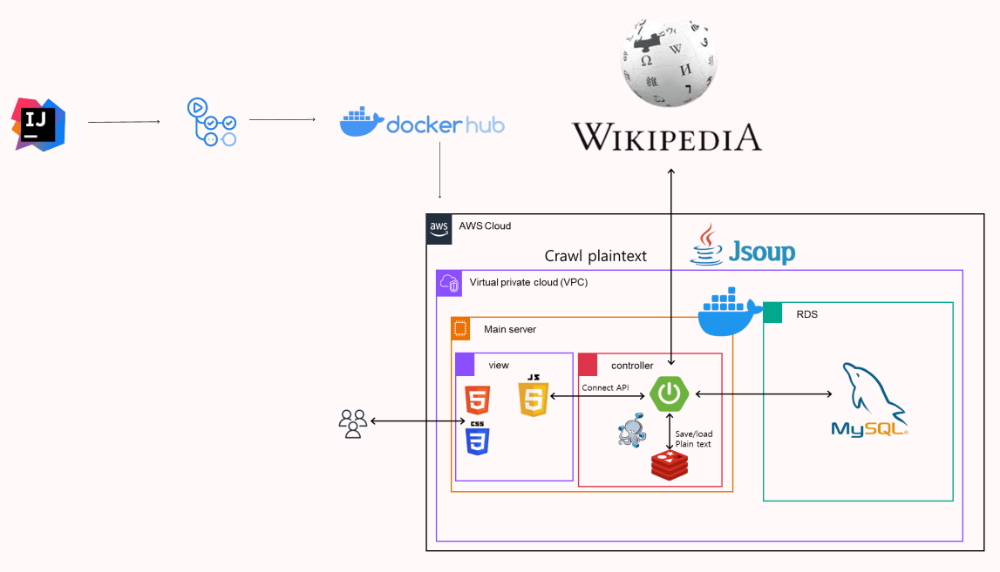

# Cipher_Quest

암호 알고리즘을 이용한 암호 퀴즈 서비스.  

### 개발 배경
GDGoC 3기 스터디 인원 분포 
 
최근 개발자들의 보안에 소흘한 태도를 보이는 현상이 있습니다.    
이로인해 사용자들의 정보가 손쉽게 유출되는 문제가 발생했습니다.  
이를 위해 보안의 뿌리인 암호화를 퀴즈 형식으로 체험할 수 있는 SW를 개발했습니다.
 

### System Architecture

