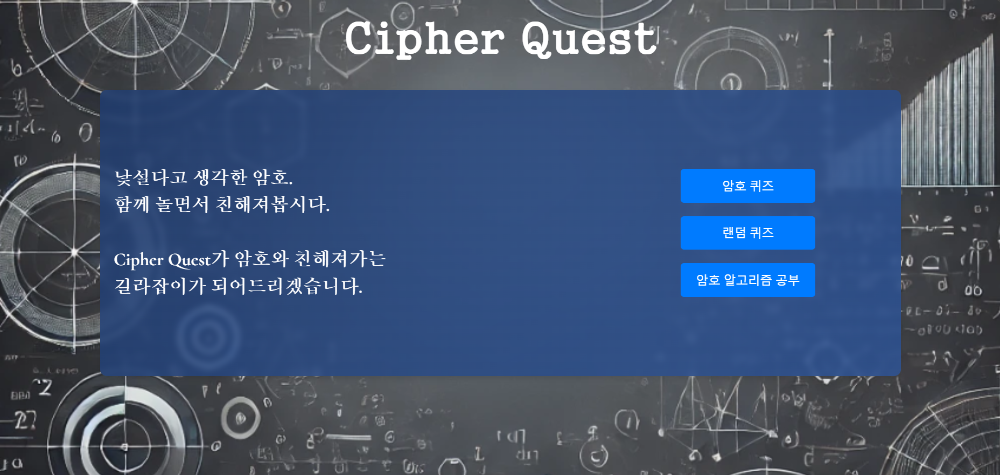

# Cipher_Quest

GDGoC 3기 정보보안 스터디의 여정을 정리한 레포지토리.  
스터디 과정과 프로젝트에 대해 정리되있습니다. 

[스터디 과정](#gdgoc-3기-정보보안-웹-해킹-암호학-스터디-과정)

[프로젝트 과정](#프로젝트-과정)  

[프로젝트 결과물](#프로젝트-결과물)  

---

# GDGoC 3기 정보보안 (웹 해킹, 암호학) 스터디 과정
스터디를 개설하게된 문제상황, 스터디 과정, 스터디를 마치고 얻은 기술에 대해 정리했습니다.
## 스터디 개설 계기

## 스터디 자료

## 스터디 커리큘럼

## 스터디 진행 중 문제해결

## 스터디를 통해 얻은 것

---

# 프로젝트 과정
GDGoC 3기 정보보안 스터디에서 진행한 암호 퀴즈 프로젝트.  

한 사람이 스테이지를 정하고 평문을 작성해서 퀴즈를 내고 한 사람이 암호문을 복호화하면서 퀴즈가 진행됩니다.  

암호 알고리즘을 서비스로 어떻게 활용할 수 있을까 고민하면서 기획과 서비스 개발을 시작했습니다.

## 프로젝트에서 고민한 사항
### 어떤 DB를 사용할 것인가?
RDBMS를 쓰기에는 테이블 간의 join을 활용할 요소가 없어서 차라리 redis를 사용해서 데이터를 불러오는 latency를 
줄이는게 좋을거같아서 redis를 사용하기로 결정했습니다.
### redis에서 TTL은 어떻게 처리할 것인가?
redis는 메모리 기반 DB이기에 불필요한 데이터의 삭제가 필수적이기에 '언제 데이터를 삭제해야되는가'를
고민했습니다. 데이터에 유지 시간을 두고 삭제를 하면 좋겠다 싶어서 시간을 프로젝트와 어떻게 연계시켜야되는가를
이어서 고민했고, 스테이지에 제한시간을 둬서 제한시간과 데이터 유지 시간을 동일하게 설정하기로 결정했습니다.
### MSA와 MA 중에서 무엇으로 구축할 것인가?
개인 프로젝트면서 소규모 프로젝트라서 프로젝트의 복잡도가 낮기에 굳이 MSA로 복잡하게 가기 보다는
MA로 API 연결과 배포에서 용이하게 하기 위해서 MA로 구축하는게 더 좋다고 생각했기에 MA로 구축하기로 결정했습니다.
## User flow chart

##  API Documents

## Using Cryptography Algorithm

## Project Architecture

---

# 프로젝트 결과물

## root directory

