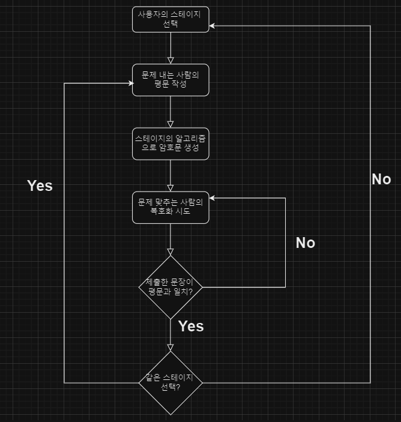
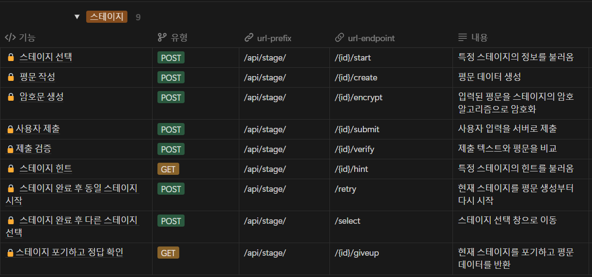
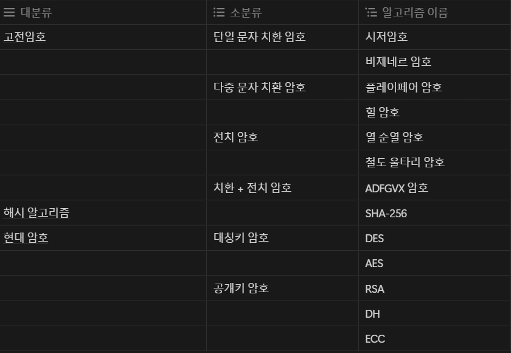
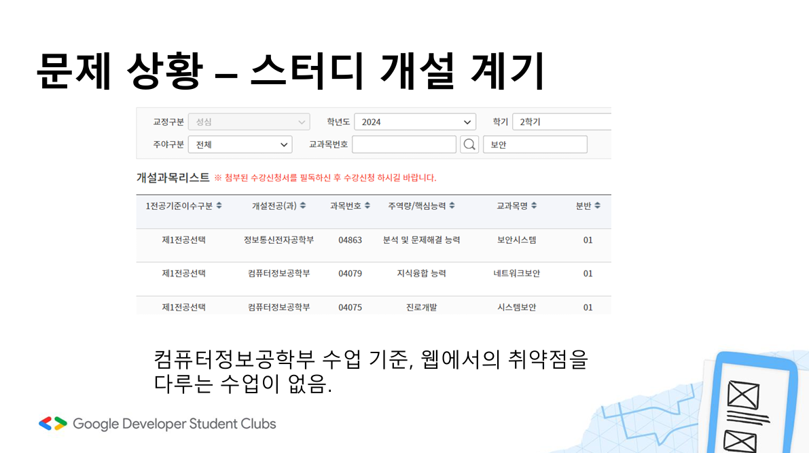
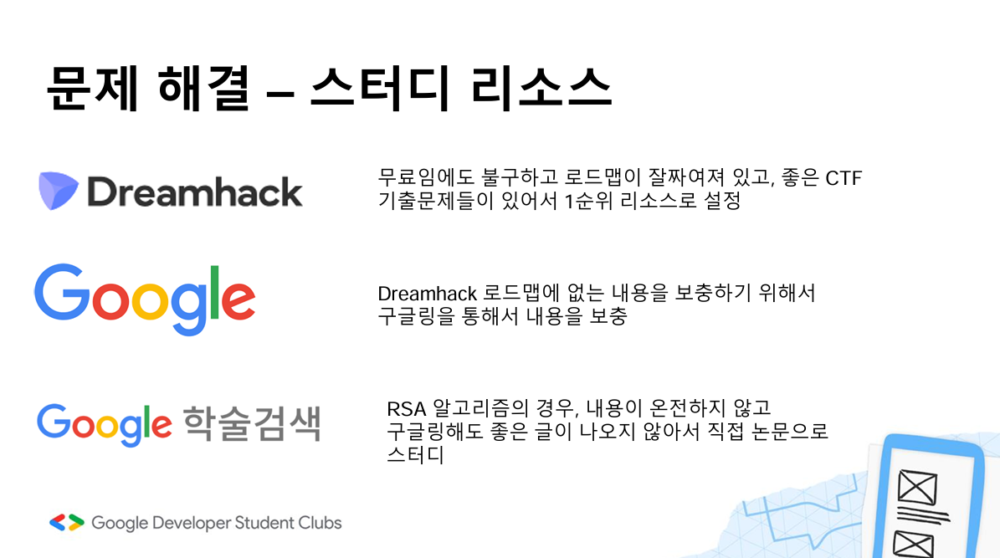
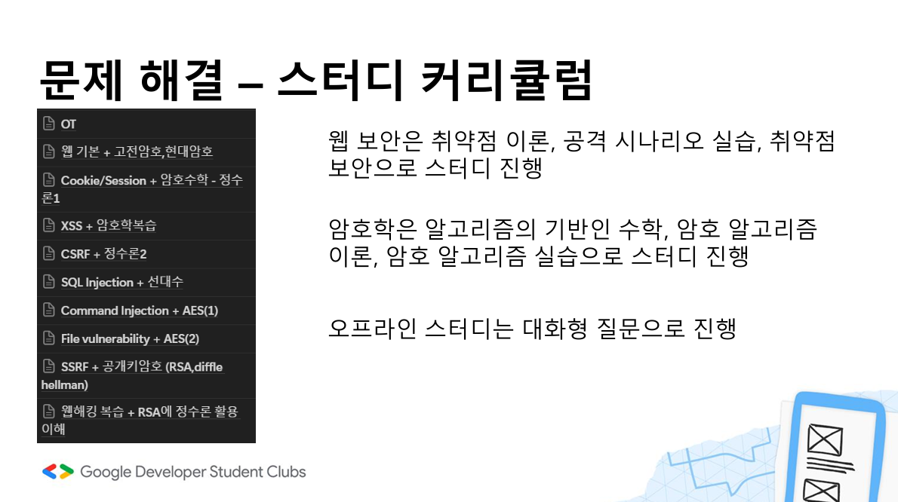
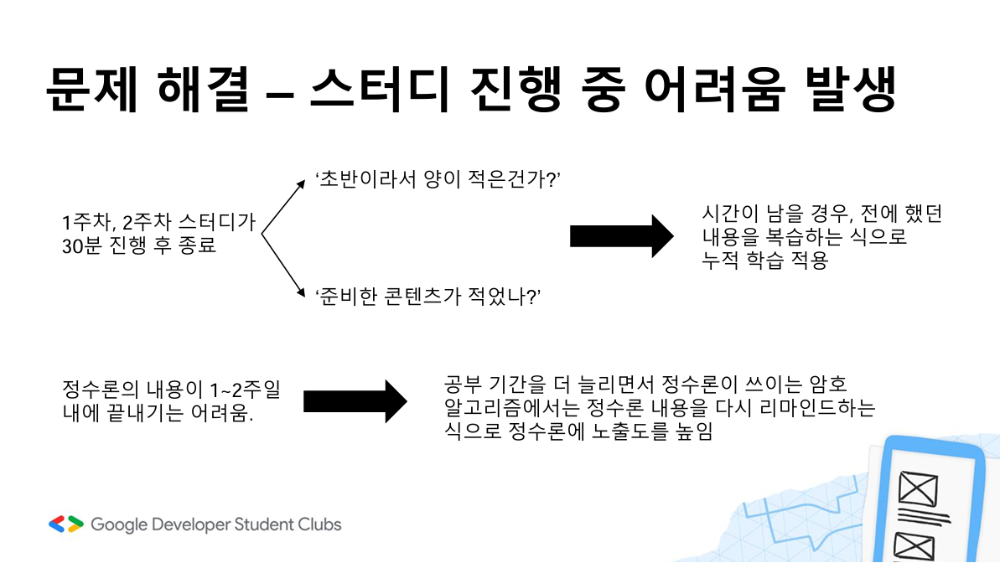
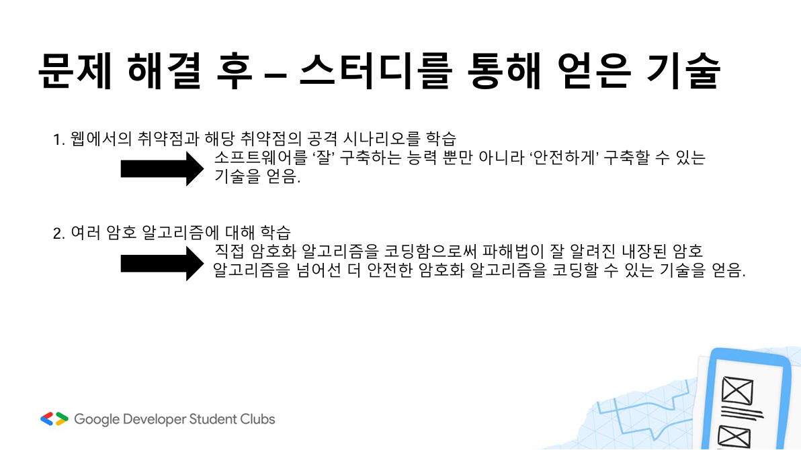

# Cipher_Quest

GDGoC 3기 정보보안 스터디에서 진행한 프로젝트와 기획한 스터디를 정리한 레포지토리.  

[프로젝트 과정](#프로젝트-관련)  

[스터디 과정](#gdgoc-3기-정보보안-웹-해킹-암호학-스터디-과정)

---

# 프로젝트 관련
GDGoC 3기 정보보안 스터디에서 진행한 암호 퀴즈 프로젝트.  

한 사람이 스테이지를 정하고 평문을 작성해서 퀴즈를 내고 한 사람이 암호문을 복호화하면서 퀴즈가 진행됩니다.  

암호 알고리즘을 서비스로 어떻게 활용할 수 있을까 고민하면서 기획과 서비스 개발을 시작했습니다.
## User flow chart

##  API Documents

## Using Cryptography Algorithm

## Project Architecture

---
  
# GDGoC 3기 정보보안 (웹 해킹, 암호학) 스터디 과정
스터디를 개설하게된 문제상황, 스터디 과정, 스터디를 마치고 얻은 기술에 대해 정리했습니다.
## 스터디 개설 계기

## 스터디 자료

## 스터디 커리큘럼

## 스터디 진행 중 문제해결

## 스터디를 통해 얻은 것

