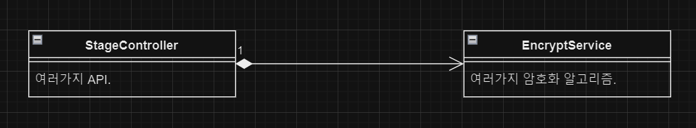
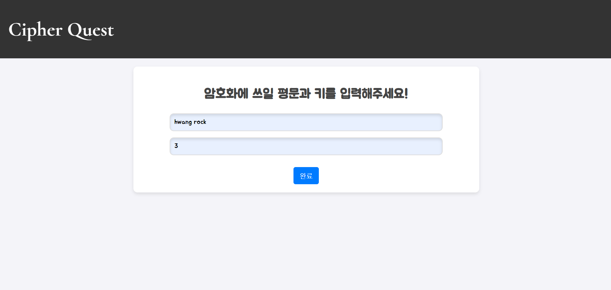

# Cipher_Quest

GDGoC 3기 정보보안 스터디의 여정을 정리한 레포지토리.  
스터디 과정과 프로젝트에 대해 정리되있습니다. 

[스터디 과정](#gdgoc-3기-정보보안-웹-해킹-암호학-스터디-과정)

[프로젝트 과정](#프로젝트-과정)  

[프로젝트에서 얻은 것](#프로젝트에서-얻은-것)

[프로젝트 결과물](#프로젝트-결과물)  

---

# GDGoC 3기 정보보안 (웹 해킹, 암호학) 스터디 과정
스터디를 개설하게된 문제상황, 스터디 과정, 스터디를 마치고 얻은 기술에 대해 정리했습니다.
## 스터디 개설 계기

## 스터디 자료

## 스터디 커리큘럼

## 스터디 진행 중 문제해결

## 스터디를 통해 얻은 것

---

# 프로젝트 과정
GDGoC 3기 정보보안 스터디에서 진행한 암호 퀴즈 프로젝트.  

한 사람이 스테이지를 정하고 평문을 작성해서 퀴즈를 내고 한 사람이 암호문을 복호화하면서 퀴즈가 진행됩니다.  

'암호 알고리즘을 서비스로 어떻게 활용할 수 있을까'부터 고민하면서 기획과 서비스 개발을 시작했습니다.

## 문제 상황 - 프로젝트 시작 계기
GDGoC 3기 스터디 인원 분포 
 
GDGoC 3기 동아리원의 스터디 가입 분포를 분석한 결과, 보안 스터디의 참여율이 4.8%로 디자인 다음으로 낮았습니다.  
지인들에게 설문을 해본 결과 "스터디가 어려울 것 같다"와 "보안은 나와 관련이 없다"는 의견이 주된 이유로 나타났습니다.

이러한 인식 개선을 위해, 보안의 근본인 암호학을 퀴즈 형식으로 체험할 수 있는 서비스를 개발해서 
보안의 무게감을 줄이고, 그 유용성을 쉽게 이해할 수 있는 기회를 제공하는 식으로 문제를 해결하고자 해서 프로젝트를 시작했습니다.

## 프로젝트에서 고민한 사항
### 어떤 DB를 사용할 것인가?
RDBMS를 쓰기에는 테이블 간의 join을 활용할 요소가 없어서 차라리 redis를 사용해서 데이터를 불러오는 latency를 
줄이는게 좋을거같아서 redis를 사용하기로 결정했습니다.
### redis에서 TTL은 어떻게 처리할 것인가?
redis는 메모리 기반 DB이기에 불필요한 데이터의 삭제가 필수적이기에 '언제 데이터를 삭제해야되는가'를
고민했습니다. 데이터에 유지 시간을 두고 삭제를 하면 좋겠다 싶어서 시간을 프로젝트와 어떻게 연계시켜야되는가를
이어서 고민했고, 스테이지에 제한시간을 둬서 제한시간과 데이터 유지 시간을 동일하게 설정하기로 결정했습니다.
### 다양한 암호 알고리즘을 어떻게 효율적으로 관리하고 확장할 것인가?
프로젝트에 들어갈 암호 알고리즘이 많고, 구현 난이도도 쉽지 않기에 구현이 되는 스테이지부터 순서대로 해야하기 때문에
 유지보수가 용이하게 코드를 설계해야해서 기존의 구조를 어떻게 바꿔야 유지보수가 용이할지 고민했습니다.

유지보수가 어려운 문제상황 (기존의 구조) 

다른 구조와 동일하게 컨트롤러에서 비즈니스 로직을 가져오는 형태를 사용하면 새로운 알고리즘을 구현할때마다 
컨트롤러에서 새로운 API를 만들어야하기 때문에 유지보수의 측면에서 비효율적이라서 설계를 개선하고자 
고민했습니다. 
(SOLID 원칙에서 OCP 원칙을 위배했다고도 합니다.)

 

해결하기 위한 설계

디자인패턴 중에서 스트래티지 패턴을 사용해서 암호 알고리즘과 컨트롤러 사이의 결합도를 줄이고, Component 어노테이션을 사용해서 
알고리즘을 스프링 컨테이너에 등록하고 API에서 사용하고자하는 암호 알고리즘을 바로 찾을 수 있게 만들어서 새로운 암호 알고리즘이 필요할때 새로운 
클래스를 만들고 Component에서 사용하고자 하는 스테이지와 연결시키는 방식으로 유지보수를 용이하게 개선했습니다.

### MSA와 MA 중에서 무엇으로 구축할 것인가?
개인 프로젝트면서 소규모 프로젝트라서 프로젝트의 복잡도가 낮기에 굳이 MSA로 복잡하게 가기 보다는
MA로 API 연결과 배포에서 용이하게 하기 위해서 MA로 구축하는게 더 좋다고 생각했기에 MA로 구축하기로 결정했습니다.

 

## User flow chart

 

##  API Documents

 

## Using Cryptography Algorithm

 

## Project Architecture

---

# 프로젝트에서 얻은 것

## 소통 및 공감
혼자서 PM, FE, BE를 모두 담당하며 서비스 개발의 모든 과정을 경험했습니다. 
이를 통해 각 역할이 겪는 어려움을 이해하게 되었고, 협업 시 더 나은 소통 능력을 갖추게 되었습니다. 
특히, FE가 필요로 하는 API 설계와 데이터 형식에 대해 깊이 이해하게 되어 더 효율적인 API를 개발할 수 있게 되었습니다. 

## 알고리즘과 디자인패턴
프레임워크에 맞춰진 코드 구조를 그대로 사용하지 않고 스트래티지 패턴을 이용해서 코드 구조를 유지보수가 용이하게 바꾸고  
여러가지 암호 알고리즘을 디자인패턴에 사용함으로써 다시금 알고리즘의 중요성과 코드 구조의 중요성을 깨달을 수 있었습니다. 
---

# 프로젝트 결과물

## 1차 진행 - MVP 기능 구현
2024년 12월 22일 ~ 2025년 1월 18일

1. CICD 구축 (github action - docker hub - EC2)
2. 암호화 알고리즘 코드 구조 설계 (스트래티지 패턴)
3. UI 구현

2차 진행 todo
1. 랜덤 문장 생성 (AI와 크롤링 중에서 고민)
2. 고전 암호 알고리즘 구현
3. 스테이지마다 힌트 적용
4. 디자인 도전, UI 더 꾸미기

## root directory

암호 퀴즈를 누르면 스테이지를 지정해서 퀴즈를 풀 수 있고, 랜덤 퀴즈를 누르면 암호문만 받게 됩니다. 
암호 알고리즘 공부를 누르면 cipher quiz에 스테이지 별로 사용된 암호 알고리즘에 대해 알아갈 수 있습니다.

## 스테이지 선택 창

스테이지마다 적용된 암호 알고리즘이 다릅니다. 쉬운거부터 어려운 순서로 배치했습니다.

## 평문과 키 생성 창

스테이지를 골라서 암호 알고리즘을 선택하고 평문과 키를 입력하면 암호문이 완성됩니다.

## 사용자 입력 제출 창

사용자가 암호문을 보고 복호화한 결과를 보냅니다. 추후에 밑에 3개의 힌트를 넣을 생각입니다.
